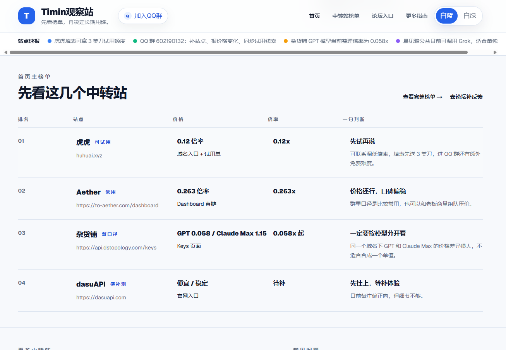
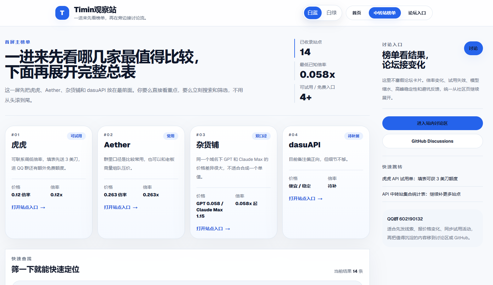

# Timix观察站

一个由社区共建的 AI 中转站观察站。我们用公开、可修正、可持续补充的方式，持续整理中转站的价格、倍率、套餐口径、试用入口和真实体验。

- 先看价格口径，再看社区备注
- 结论尽量可追踪，也允许后续修正
- 不会写代码，也能补充线索、截图和反馈

如果你也长期在用各类中转站，欢迎一起把它做成一个真正有用、能长期维护的公共项目。

## 在线访问

- GitHub 仓库：[hfeng620-cmd/timin_api_test_and_forum](https://github.com/hfeng620-cmd/timin_api_test_and_forum)
- GitHub Discussions：[社区讨论区](https://github.com/hfeng620-cmd/timin_api_test_and_forum/discussions)
- GitHub Pages 地址：`https://hfeng620-cmd.github.io/timin_api_test_and_forum/`

如果第一次推送工作流后还没上线，需要到仓库 `Settings > Pages` 里确认来源为 `GitHub Actions`。

### 访问地址怎么选

- **正式给别人访问**：优先用 VPS 地址 `http://38.76.162.40:3000`，速度快，功能全。
- **备用地址**：GitHub Pages `https://hfeng620-cmd.github.io/timin_api_test_and_forum/`，VPS 挂了也能访问。
- `http://127.0.0.1:3001` 只适合本机调试。
- 同一局域网内访问，可以启动 `npm run dev -- -H 0.0.0.0 -p 3001`，再让对方打开 `http://本机IP:3001`。

### 数据安全

所有数据（用户、帖子、站点）存储在 **Supabase 云端**，与服务器无关：
- VPS 关机或重装 → **不影响线上数据**
- 电脑关机 → **不影响其他人访问**
- GitHub Pages 上的版本和 VPS 版本用的是**同一个 Supabase 数据库**
- 换新 VPS：运行 `bash scripts/timin-recover.sh` 一键恢复

## 部署架构

| 组件 | 地址 | 说明 |
|------|------|------|
| VPS 主站 | http://38.76.162.40:3000 | 服务器模式，功能完整 |
| GitHub Pages 备用 | https://hfeng620-cmd.github.io/timin_api_test_and_forum/ | 静态导出，VPS 挂了也能访问 |
| Supabase 数据库 | svksgdsuquhkwyliavfn.supabase.co | 云端 PostgreSQL，不依赖任何服务器 |

## 页面预览

### 首页榜单入口



### 中转站榜单页



### 社区讨论页


## 这版已经有的内容

- 默认 `白蓝` 主主题，保留 `白绿` 备用主题
- 首页聚焦主入口，先看榜单，再进讨论和指南
- 榜单页支持首屏重点站点、搜索、筛选、更多中转站展开和补充提交
- 已补入提交补充流程，方便后续由管理员审核
- 论坛入口页已接入 Supabase 邮箱登录、待审核发帖、回复和点赞；管理员通过后所有访客可见，并保留 GitHub Discussions 分流

## 项目想解决什么问题

很多中转站信息现在都散落在群聊、私聊和零碎截图里：

- 有的只写倍率，不写模型口径
- 有的有试用额度，但入口不固定
- 有的同一站不同套餐差异很大，容易被写成一个误导数字
- 有的“稳定”或“便宜”只是口头经验，没有统一整理

这个项目不想做一个空壳导航页，而是想做一个能被社区共同维护、能不断纠错和补充的观察站。

## 当前页面结构

- `/`
  首页，负责主榜单入口、资源速报、讨论入口和常见问题
- `/stations`
  核心榜单页，负责中转站价格、倍率、收费方式、备注、筛选搜索和补充提交
- `/community`
  论坛入口页，负责发帖、报料、避坑、讨论和协作引导
- `/admin`
  管理员审核原型页，支持通过、修改后通过和驳回
- `/guides`
  指南页，负责解释倍率、试用路线、共建流程和常见问题
- `/models`
  模型页，负责先看模型任务，再回站点页做价格和入口比较

## 当前已录入的中转站

- Aether
- 虎虎
- 杂货铺
- viptoken站
- ai8.my
- Primdream
- WayX
- Liary
- dasuAPI
- dazes.cc
- 秋天中转站 `qiutian.live`
- xiaoya-api
- 星见雅公益

## 当前资源入口

- 虎虎 API 试用单
- API 中转站集合统计表
- QQ 群共建入口
- GitHub Discussions 沉淀入口

## 加入 QQ 群

群号：`602190132`

如果你想一起补中转站信息、提交试用入口、反馈价格变化，或者帮忙一起维护这个项目，欢迎加入 QQ 群。


## 你可以怎么参与

1. 发现线索：新站点、价格变化、邀请码、试用入口、踩坑反馈
2. 补充证据：原始链接、截图、价格口径、出现时间、模型分组
3. 发起协作：`Discussion / Issue / PR`

不会写代码也没关系，先补一条准确信息就很有价值。

## 推荐协作方式

1. 新线索先进 `QQ 群` 或 `Discussions`
2. 明确纠错、过期价格和待核验条目走 `Issue`
3. 真正进入站点内容的改动统一走 `PR`

一句话版本：`QQ群负责线索流，Discussions 负责长讨论，Issues 负责逐条处理，最终入站只认 PR。`

## 本地运行

```bash
npm install
npm run dev -- -p 3001
```

打开 `http://127.0.0.1:3001`。如果要让同一局域网设备访问，使用：

```bash
npm run dev -- -H 0.0.0.0 -p 3001
```

## 开机自启动临时公网预览

如果暂时希望 Windows 登录后自动启动本地预览和 Cloudflare 临时公网入口，可以使用 `cloudflared tunnel --url http://localhost:3001`。

项目已提供脚本。首次使用前需要先安装依赖，并确保 `cloudflared` 已安装且在 PATH 中：

```powershell
npm install
winget install --id Cloudflare.cloudflared
.\scripts\install-timin-public-preview-startup.ps1
Start-ScheduledTask -TaskName "TimixObserveDevTunnel"
```

日志放在 `%LOCALAPPDATA%\TimixObserve\logs`，最新状态写入 `%LOCALAPPDATA%\TimixObserve\latest-url.txt`。计划任务只在安装脚本执行后生效，触发时间是当前用户登录 Windows 后；如果还没有安装，`Start-ScheduledTask` 会找不到任务。卸载自启动任务：

```powershell
.\scripts\uninstall-timin-public-preview-startup.ps1
```

注意：Quick Tunnel 地址不是固定入口。它适合短期给别人看本机开发版；正式入口仍然使用 GitHub Pages。

## Cloudflare named tunnel 固定公网入口

如果已经有 Cloudflare 账号和可用域名，可以用 named tunnel 绑定一个长期固定的 Cloudflare 地址。固定入口仍然依赖这台电脑上的 Next 和 `cloudflared` 进程在线。

首次配置示例：

```powershell
winget install --id Cloudflare.cloudflared
cloudflared tunnel login
cloudflared tunnel create timin-observe
cloudflared tunnel route dns timin-observe observe.example.com
```

在 `C:\Users\<你的用户名>\.cloudflared\config.yml` 写入或确认配置，`credentials-file` 路径以 `cloudflared tunnel create` 输出为准：

```yaml
tunnel: timin-observe
credentials-file: C:\Users\<你的用户名>\.cloudflared\<TunnelID>.json

ingress:
  - hostname: observe.example.com
    service: http://localhost:3001
  - service: http_status:404
```

启动固定入口，可以直接调用脚本，也可以使用 npm start 脚本：

```powershell
npm run start:named-tunnel -- -Port 3001 -TunnelName "timin-observe" -Hostname "observe.example.com" -ConfigPath "$env:USERPROFILE\.cloudflared\config.yml"
```

```powershell
.\scripts\start-timin-named-tunnel.ps1 -Port 3001 -TunnelName "timin-observe" -Hostname "observe.example.com" -ConfigPath "$env:USERPROFILE\.cloudflared\config.yml"
```

脚本会先启动本地 Next，再执行 `cloudflared tunnel run` 运行 named tunnel，并把固定入口写入 `%LOCALAPPDATA%\TimixObserve\latest-url.txt`。日志仍放在 `%LOCALAPPDATA%\TimixObserve\logs`。

## GitHub Pages 自动部署

仓库已经补入 GitHub Pages 工作流：

```bash
npm run build
```

本地构建会输出静态站点到 `out/`，推送到 `main` 后会通过 GitHub Actions 自动部署到 Pages。

如果仓库第一次启用 Pages，建议检查：

1. `Settings > Pages` 是否已切到 `GitHub Actions`
2. `Settings > Actions > General` 是否允许工作流运行
3. 仓库主页的 `Actions` 标签页里是否出现 `部署 GitHub Pages`

## 当前关键文件

- `src/app/page.tsx`：首页
- `src/app/stations/page.tsx`：榜单页
- `src/app/community/page.tsx`：论坛入口页
- `src/app/guides/page.tsx`：指南页
- `src/app/models/page.tsx`：模型页
- `src/app/admin/page.tsx`：审核原型页
- `src/lib/site-data.ts`：站点数据、资源入口和页面文案
- `.github/workflows/deploy.yml`：GitHub Pages 自动部署
- `next.config.ts`：静态导出和 Pages 路径配置

## 下一步最值得继续补的内容

- 各站高峰期稳定性反馈
- 模型分组和真实可用性
- 部分待补价格站已确认可调用 GPT-5.5 / GPT-5.4，价格倍率和稳定性仍待样本确认
- 更多试用入口与注册送额信息
- 站内发帖已升级为 Supabase 邮箱登录与待审核发布；后续可继续补管理员工作台和通知邮件
- 打开 GitHub Discussions 后把群里高质量讨论慢慢沉淀进来

## 管理员引导

1. **注册管理员账号**：打开站点的 `/community` 页面，点击"登录邮箱"，用你的邮箱注册并完成邮箱验证，然后设置密码。
2. **获取你的用户 ID**：登录后，打开浏览器开发者工具（F12），在 Console 里输入：
   ```js
   (await (await import('/_next/static/chunks/...')).getSupabaseClient?.() ?? window.__supabase)?.auth?.getUser()
   ```
   或者更简单的方式：到 Supabase Dashboard → Authentication → Users 页面，找到你的邮箱对应的 UUID。
3. **执行管理员 Bootstrap SQL**：打开 Supabase Dashboard → SQL Editor，新建查询，粘贴执行：
   ```sql
   insert into public.forum_admins (user_id)
   select id from auth.users where lower(email) = lower('你的邮箱@example.com')
   on conflict (user_id) do nothing;
   ```
   把 `你的邮箱@example.com` 换成你实际注册的邮箱。
4. **验证**：回到站点 `/admin` 页面，点击"登录邮箱"，用你的管理员邮箱登录后点"刷新"，应该能看到待审核帖子列表。

## Supabase 配置说明

- 需要在 Supabase 项目中开启 Email 认证（Authentication → Providers → Email）
- 需要在 SQL Editor 中执行 `supabase/forum-schema.sql` 创建表和 RLS 策略
- `.env.local` 中需要配置 `NEXT_PUBLIC_SUPABASE_URL` 和 `NEXT_PUBLIC_SUPABASE_ANON_KEY`

